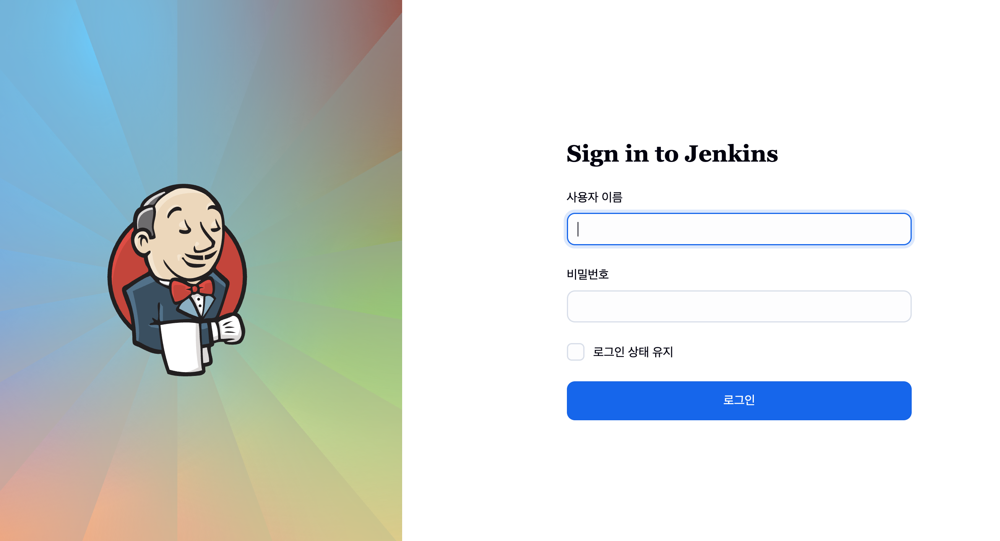
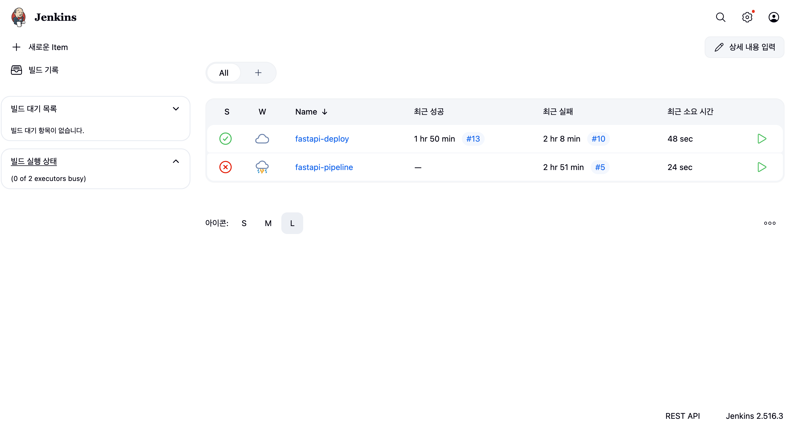
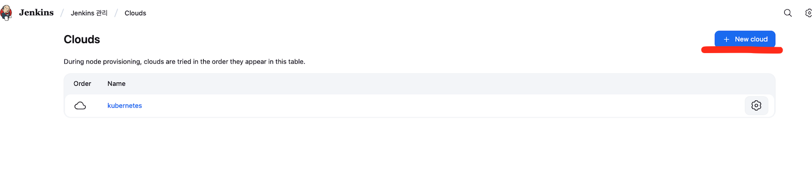
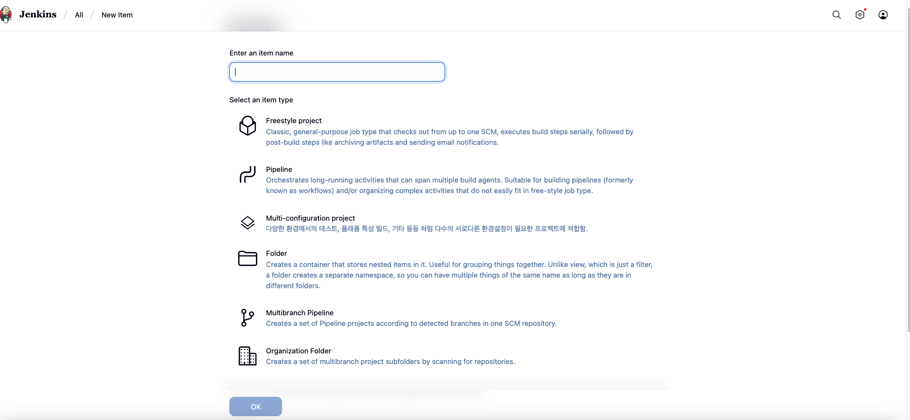
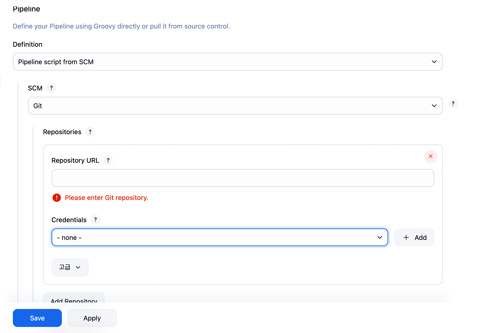
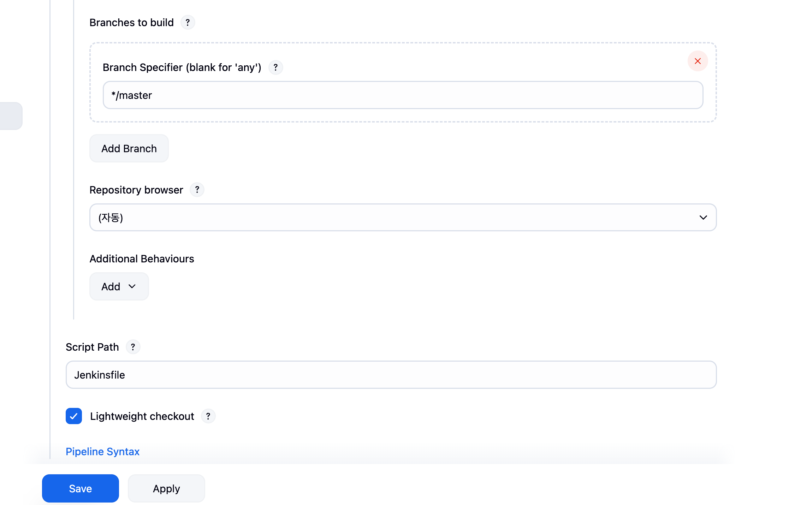
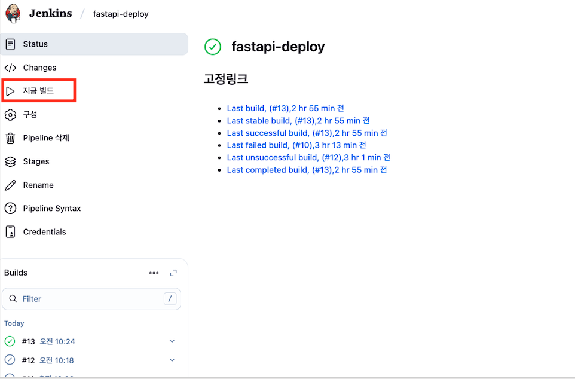

참고한 자료

젠킨스 k8s 에 설치하는 법 아래 보고 따라하다가 귀찮아서 클로드 시킴
(pv, pvc 볼륨 설정 및 deployment 는 기존과 다릅니다.)

https://www.jenkins.io/doc/book/installing/kubernetes/


## 구동 방법 매우 간단

구동하는 법은 아래를 따라서 하면 됩니다.

1. 젠킨스 yaml 로 설치하기
2. kuberentes cloud 설정하기
3. 파이프 라인 만들기
4. 빌드 나우 하기


## 젠킨스 k8s 로 구동하기


```sh
# 젠킨스 실행하기
kubectl apply -f jenkins-deployment.yaml

# pod, svc, deployment 한번에 확인하는 명령어 -n : namespace
kubectl get all -n devops-tools

# 실행 중인 파드로 들어가서 직접 젠킨스 초기 비밀 번호 cat 을 통해 알아내기 이걸 아래 사진에 입력하는 것임
kubectl exec -it deployment/jenkins -n devops-tools -- cat /var/jenkins_home/secrets/initialAdminPassword

```


이후에 아래 필수 제안 인스톨을 한 후

Install suggested plugins - to install the recommended set of plugins, which are based on most common use cases.


완료가 되면 아래 같은 모습이 보이고 로그인 하면 됨



로그인을 하면 아래와 같은 형태를 볼 수 있습니다. (저는 테스트를 하니라 뭔가 좀 아이템이 있는 겁니다.)




## 🏢 실무 방식 : Kubernetes Plugin + 동적 에이전트 구조

```
Jenkins Master (가벼움, 저는 도커도 있는 버전이긴 함)
    ↓
Kubernetes가 필요할 때마다 Agent Pod 생성(젠킨스와 쿠버네티스 연결을 위해 쿠버네티스 클라우드 필요)
    ↓
작업 완료 후 자동 삭제
```

## Kubernetes Cloud 설정하기

🎯 Kubernetes Cloud의 역할
1. Kubernetes Cloud란?

    Jenkins와 Kubernetes를 연결하는 브릿지 설정


쿠버네티스 클라우드 설정 필요 젠킨스에서 세팅 누르고 거기서 이제 클라우드로 보이는 곳 찾아야 함


아래로 이동 후 New item 클릭해야 함



## Kubernetes Cloud 설정
### Step 1: Jenkins에서 Kubernetes Cloud 추가
```
Manage Jenkins 클릭
Clouds 클릭 (또는 Manage Nodes and Clouds)
New cloud 클릭
Name: kubernetes 입력
Type: Kubernetes 선택
Create 클릭
```

### Step 2: Kubernetes Cloud 설정
Kubernetes Cloud details:


```yaml
Name: kubernetes
  ↓ Pipeline에서 참조할 이름

Kubernetes URL: https://kubernetes.default
  ↓ Kubernetes API 서버 주소
  ↓ Jenkins가 Kubernetes와 통신하는 엔드포인트

Kubernetes server certificate key: (비워둠)

Disable https certificate check: ☑️ 체크

Kubernetes Namespace: devops-tools
  ↓ Agent Pod를 어느 네임스페이스에 생성할지

Credentials: (None으로 둠 - ServiceAccount 사용)

Jenkins URL: http://jenkins-service.devops-tools.svc.cluster.local:8080
  ↓ Agent Pod가 Jenkins Master에 연결할 주소
  ↓ Agent → Master 역방향 연결

Jenkins tunnel: (비워둠)

```

중요 설정:

☑️ WebSocket 체크

### Step 3: Test Connection
화면 하단의 Test Connection 버튼 클릭
```
Connected to Kubernetes v1.~~
```

### Step 4: 저장


### 🔧 각 입력한 값 역할별 상세 설명


1. Kubernetes URL

```yaml
Kubernetes URL: https://kubernetes.default
```

역할:

* Jenkins가 "여기로 API 요청 보내면 Kubernetes야" 하고 알려주는 주소
* Pod 생성, 삭제, 상태 확인 등 모든 명령이 여기로 감

없으면:
```
ERROR: Unable to connect to Kubernetes
```

2. Jenkins URL
```yaml
Jenkins URL: http://jenkins-service.devops-tools.svc.cluster.local:8080
```
역할:

* Agent Pod가 생성되면, "Jenkins Master님, 저 준비됐어요!" 하고 연결할 주소
* Agent → Master 통신 경로

이해하기:
```
빌드 시작
  ↓
Jenkins: "Kubernetes야, Agent Pod 하나 만들어줘!"
  ↓ (Kubernetes URL로 요청)
Kubernetes: "네, 만들었어요!"
  ↓
Agent Pod 생성됨
  ↓
Agent Pod: "Jenkins님, 저 준비됐어요!"
  ↓ (Jenkins URL로 연결)
Jenkins: "좋아, 이 작업 해줘!"
```

없으면:
```
Agent Pod는 생성되지만
Jenkins와 연결 못함
→ 빌드 시작 안됨
```


3. Namespace

```yaml
Kubernetes Namespace: devops-tools
```
역할:

* Agent Pod를 어디에 만들지 지정
* 다른 앱들과 격리


4. Pod Templates (선택사항)

설정 안해도 됨! Jenkinsfile에서 YAML로 정의하기 때문:

```groovy
agent {
    kubernetes {
        yaml '''
        
        ... Pod 정의 ...

        '''
    }
}
```
하지만 설정하면:

여러 Pipeline에서 재사용 가능
Jenkinsfile이 간결해짐

```groovy
// Cloud 설정에 Pod Template 있으면
agent {
    label 'docker-kubectl'  // 이것만 써도 됨!
}
```


## pipeline 설정하기

이후 홈 화면으로 돌아와서 new item 클릭하면 다음과 같은 사진을 볼 수 있습니다.



여기서 이름을 원하는 것으로 선택 후 pipeline 설정 후 ok 누르기

이후 핵심은 아래 pipeline definition 을 설정하는 것임 repository url 에 넣은 깃 url 을 넣고 (만약 프라이빗이라면 credential 설정이 필요함)




아래 사진과 같이 git branch 그리고 Jenkinsfile 의 경로를 설정해야 한다.



이후엔 설정된 젠킨스 파일에 돌아간 후 build now 를 하면 배포가 이뤄진다.




## 삭제 방법


```
# 생성할 때 사용한 YAML로 삭제
kubectl delete -f jenkins-deployment.yaml

#한번에 삭제 추천

# 한 줄로 모든 것 삭제
kubectl delete namespace devops-tools && \
kubectl delete pv jenkins-pv-volume && \
kubectl delete storageclass jenkins-local-storage && \
kubectl delete clusterrole jenkins-admin && \
kubectl delete clusterrolebinding jenkins-admin

# Docker 이미지도 정리
docker rmi $(docker images 'fastapi-app' -q)


```


## 트러블 슈팅 tmi

도커가 설치안되어 있었음 그럴 경우 yaml 에 이렇게 postStart 로 설치하면 됨

```
lifecycle:
          postStart:
            exec:
              command:
                - /bin/sh
                - -c
                - |
                  apt-get update && apt-get install -y docker.io

```

쿠버네티스 빌드하려고 생각해보니 뭔가 중량이 매우 무거워 보였음 그래서 

마스터 에이전트 구조를 이용하고자 함 (클로드에게 설명 요청함)


## 참고한 블로그

https://kindloveit.tistory.com/125#google_vignette